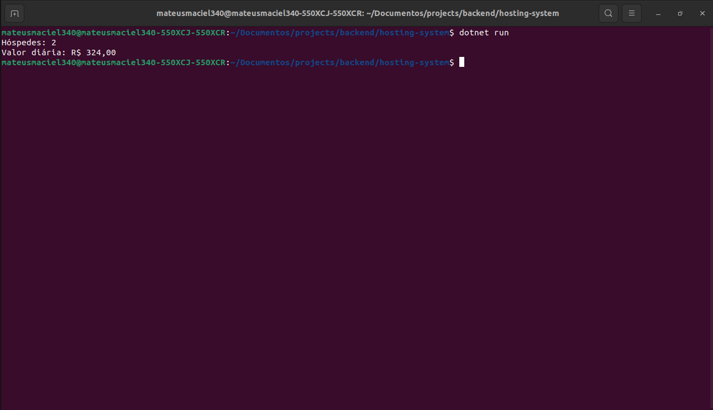

# Hosting System

    

    
    
    

## About:

Hosting system responsible for operating some basic functionality with dotnet. Its main features are: adding new accommodations, based on the number of days booked by a particular person. Adding suites and performing the calculation of the value required for operation.

## Features:

As with any backend project, a few steps were taken until the basic completion of the first version of this project.

- Boot from project base
- Adding functionalities within the reservation class: Adding Suite and Reservation + Reservation calculation.
- Testing area in `Program.cs` for new extensions of the reserve class.

### Examples:

-x-

## Layout:

    

Video result can be seen on my linkedin - publications:

[mateusmaciel340](https://www.linkedin.com/in/mateusmaciel340/)

## How to run the project?

To start the project components:
``dotnet build``

Run the program:

``dotnet run``

### Usage settings:

-x-

## Technologies:

The following tools were used in building the project:

### Backend (CSharp)

- CSharp

## Contributors:

<table>
    <thead>
        <tr>
            <td>
                
            </td>
        </tr>
    </thead>
    <tbody>
        <tr>
            <th>Mateus Maciel</th>
        </tr>
    </tbody>
</table>

## How to contribute?

1. Fork the project.
2. Create a new branch with your changes: `git checkout -b my-feature`
3. Save the changes and create a commit message telling what you did: `git commit -m Modifying this [...]`
4. Submit your changes: `git push origin my-feature`

## License:

This project is under license [MIT](https://github.com/git/git-scm.com/blob/main/MIT-LICENSE.txt).